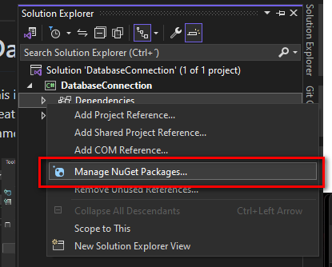
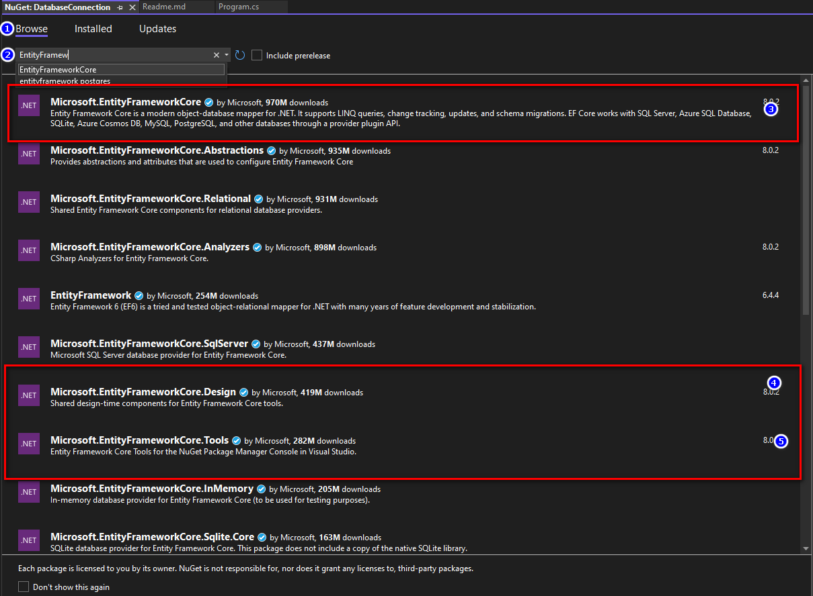
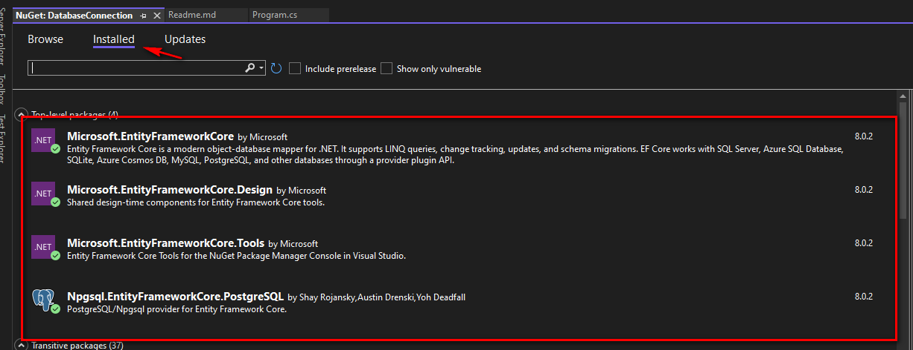
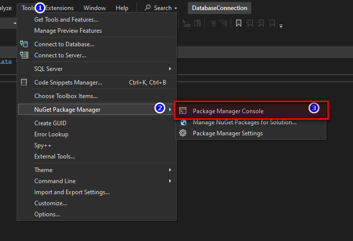
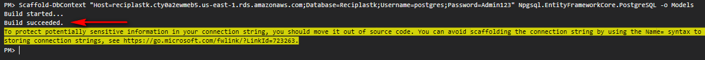
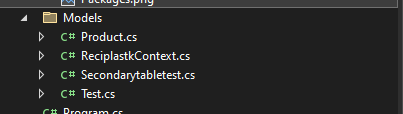

# Database connection.
This is the template and instructions on how to create the connection to the database, using entity framework and postgres database.


1. Install the packages required to work with entity framework

	* Microsoft.EntityFrameworkCore
	* Microsoft.EntityFrameworkCore.Tools
	* Microsoft.EntityFrameworkCore.Design
	* Npgsql.EntityFrameworkCore.PostgreSQL
	Right click on the reference item:
	

	Go to `Browse` tab and start typoing the name of the packages listed above, Install one by one, acept the terms and let it finish:

	After installing all the dependencies you should see them all in the `Installed` tab:

	

2. Open the package console and paste the following command, replace the conection string if necessary



Run the command to generate the models, based on the database: 
```
Scaffold-DbContext "Host=reciplastk.cty0a2ewmeb5.us-east-1.rds.amazonaws.com;Database=Reciplastk;Username=postgres;Password=Admin123" Npgsql.EntityFrameworkCore.PostgreSQL -o Models
```
You should see the following results.


Also, a new folder should be created with the DB conection and the models in it.



3. To use the connection to the database you should create a instance of the DBContext. 
After you create the DBContext instance you should be able to access to every table you have in you database. Ex: `db.MyTable`
Then you should use the main operations on the tables:
	
	1. **List**: In order to get all the entries from the table (SELECT * FROM), you should use the `.ToList()` method. 
		
		Example `db.MyTable.ToList();`.
	1. **Filter**: In order to filter the information, you should use the Where method. I can use `.ToList()` to return a list of rows or `.FirstOrDefault()` to return only one row.
		
		Example: 
		1. To get many: `db.MyTable.Where(p=> p.MyField == "Pedro").ToList();` 
		1. To get only one: `db.MyTable.Where(p=> p.MyField == "Pedro").FirstOrDefault();`
	1. **Create**: In order to create a new row you should create an instance of the Model, then call the `.Add()` method and then call the `SaveChanges()` method.	 
		
		Example: 
		```
			var model = new MyTableModel();
			model.MyProperty = "My new value";
			db.MyTable.Add(model);
			db.SaveChanges()
		```
	1. **Update**: In order to change the information of a row, you should use the filter to get the row you want to modify, then change it normall as changing a variable, Finally, dont forget to call the `SaveChanges()`
		 
		Example: 
		```
			var row = db.MyTable.Where(p=> p.MyField == "Pedro").FirstOrDefault();
			row.MyProperty = "The new value";
			db.SaveChanges();
		```
	1. **Delete**: In order to delete a row, you should use the filter method to get the row you want to delete, then call the `.Remove()` method. 
		
		Example: 
		```
			var row = db.MyTable.Where(p=> p.MyField == "Pedro").FirstOrDefault();
			db.Remove(row);
			db.SaveChanges();
		```